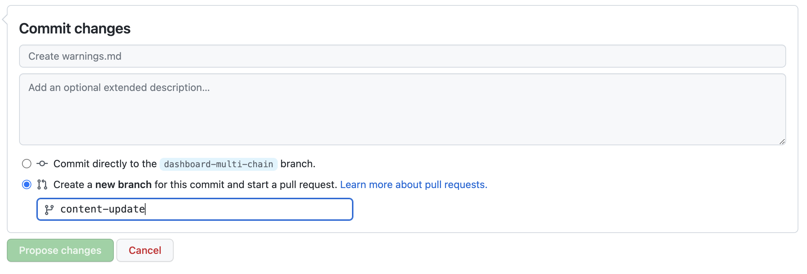

[](https://discord.gg/OlympusDAO)


# [Ω Olympus Frontend](https://app.olympusdao.finance/)

This is the front-end repo for Olympus.

## 🔧 Setting up Local Development

Required:

- [Node v16.15.0](https://nodejs.org/download/release/latest-v16.x/)
- [Yarn](https://classic.yarnpkg.com/en/docs/install/)
- [Git](https://git-scm.com/downloads)

```bash
$ git clone https://github.com/OlympusDAO/olympus-frontend.git
$ cd olympus-frontend

# set up your environment variables
# read the comments in the .env files for what is required/optional
$ cp .env.example .env

# fill in your own values in .env, then =>
$ yarn
$ yarn start

# Set up Husky (for pre-commit hooks) by running:
$ yarn prepare
```

The site is now running at `http://localhost:3000`!
Open the source code and start editing!

## Testing

We use the [Vitest](https://vitest.dev/guide/) test driver for unit tests, snapshot tests and e2e tests.

To run tests in interactive mode during development:

```sh
yarn test
# or
yarn test --ui
```

### Unit Testing

Unit test files are co-located with the source code files that they test and follow the naming convention `*.unit.test.ts`.
For example unit tests for `OriginalSourceFile.ts` are located in `OriginalSourceFile.unit.test.ts`.
Valid extensions for test files are `.js` (JavaScript), `.ts` (TypeScript), `.jsx` (React JSX), `.tsx` (React TSX).

To run all unit test and see a coverage report:

```bash
yarn test:unit
```

Note that the focus of unit testing is to exercise all paths through the code hosted in this repo and **only** code hosted in this repo. To the extent possible, unit tests should abstract out dependencies such as remote API calls as well as crypto wallet APIs via [`mock functions`](https://vitest.dev/guide/mocking.html).

Coverage thresholds are enforced via CI checks. If a new PR introduces regression in code coverage, the CI will fail. The goal is to keep us at a minimum level of test automation coverage as we introduce new code into the repo. To see the current coverage thresholds, see the `coverageThreshold` in [`package.json`](package.json).

For integration testing automation that runs browser and remote API code as well as our own code, see the End-to-end (E2E) testing section below.

### Mocking Remote API Calls

Unit tests should minimize dependency on remote API calls. Remote API calls slow down test execution and they also occasionally error, which may fail tests for reasons outside the app code being tested. Live API calls should be tested in End-to-end/Integration tests.

[Here is an example unit test](src/helpers/index.unit.test.js) that conditionally mocks API calls.

### Generative Testing

We use [`fast-check`](https://github.com/dubzzz/fast-check) for generative testing which provides property-based coverage for ranges of input values.
[Here is an example](src/helpers/33Together.unit.test.ts) of a unit test case in this repo that uses generative testing.

### Snapshot Testing

We use [Snapshot tests](https://vitest.dev/guide/snapshot.html) to make sure the UI does not change unexpectedly.
When you make changes to the UI (intentionally), you likely will have to update the Snapshots. You can do so by running:
`yarn snapshot`.

[Here is an example](src/views/Stake/__tests__/Stake.unit.test.tsx) snapshot test and [here is the correspoding recorded snapshot](https://github.com/OlympusDAO/olympus-frontend/blob/develop/src/views/Stake/__tests__/__snapshots__/Stake.unit.test.tsx.snap). Keep in mind that for snapshot tests to be meaningful, they have to pre-populate components with variety of data sets (realistic, edge case, invalid).

[Here is a good blog post](https://dev.to/tobiastimm/property-based-testing-with-react-and-fast-check-3dce) about testing React components with generative data sets.

### React Component Testing

We use [React Testing Library](https://testing-library.com/docs/react-testing-library/intro/) to test behavior of UI components.
Here is an [example component test](src/components/Migration/__tests__/MigrationModal.unit.test.jsx).
Here is a useful [cheat sheet](https://testing-library.com/docs/react-testing-library/cheatsheet).

### Mocking React Hooks

When testing components that use React Hooks to third party libraries such as React Query or Web3Provider, it is sometimes convenient to mock these hooks in order to simulate various data inputs and edge cases.

[Here is an example test case](src/views/Stake/components/StakeArea/components/StakeActionArea/components/__tests__/StakeBalances.unit.test.jsx) that shows how to mock React Hooks that use Web3Provider and React Query APIs.

### Troubleshooting

If all tests are failing in your local environment (in particular, due to a "cannot find module" error with `node_modules/babel-preset-react-app/node_modules/@babel/runtime/helpers/interopRequireDefault.js`), but they should be passing (and the CI tests are passing), it's likely to be an issue with your local cache. Run the following command: `yarn test --clearCache`

## End-to-end testing

Puppeteer (with the Dappeteer addition) is used to do browser-based end-to-end testing.

To run the tests:

- Run the frontend, using `yarn start`
- In another terminal, run the tests, using `yarn test:e2e`

## Architecture/Layout

The files/folder structure are a **WIP** and may contain some unused files. The project is rapidly evolving so please update this section if you see it is inaccurate!

```sh
./src/
├── App.tsx       // Main app page
├── abi/          // Contract ABIs
├── assets/       // Static assets (SVGs)
├── components/   // Reusable individual components
├── constants/    // Addresses & common contracts
├── helpers/      // Helper methods to use in the app
├── hooks/        // Shared reactHooks
├── themes/       // Style sheets for dark vs light theme
└── views/        // Individual Views
```

## Theme Support

Material UI components, such as `Button`, can use the current theme's color scheme through the `color` property. For example:

```JSX
 <Button variant="contained" color="primary" className="cause-give-button">
  Give Yield
 </Button>
```

If you wish to use a theme's color scheme manually, follow these steps:

1. Import `useTheme`: `import { useTheme } from "@material-ui/core/styles";`
1. Instantiate the theme: `const theme = useTheme();`
1. Add a style property to the component, for example:

```JSX
 <Grid item className="cause-category" style={{ backgroundColor: theme.palette.background.default }}>
 {category}
 </Grid>
```

For the available theme properties, take a look at the themes in `src/themes`.

## ESLint

We use ESLint to find/automatically fix problems.

- react-app and react-hooks/recommended are important with react stuff.
- @typescript-eslint/recommended and @typescript-eslint/eslint-recommended as recommended defaults.
- unused-imports to automatically remove unused imports.
- simple-import-sort to automatically sort imports alphabetically. This is opinionated, but useful because it helps avoid merge conflicts with imports (and who doesn't like neat alphabetically sorted imports anyway).
- @typescript-eslint/explicit-function-return-type and @typescript-eslint/explicit-module-boundary-types are turned off to prioritise inferred return types over explicit return types. This is opinionated, but often times the inference Typescript makes is good enough, and sometimes help prevents type mismatches that are a pain to debug.
- @typescript-eslint/ban-ts-comment and @typescript-eslint/ban-ts-ignore are also turned off. This could possibly be temporary, but the ability to use @ts-ignore-like directives is certainly handy as an escape hatch as we encounter errors during the migration to TS.

## Reusable Components (Component Library)

Our codebase uses a custom component library extended from Material UI to make common UI patterns easy to implement on the frontend.
An up-to-date list of available components, implementation examples as well as documentation is available here:

[](https://master--61c4d644c064da004aebdd97.chromatic.com/)

Contributions are welcome and encouraged to our Component Library. If you see repeated UI patterns not represented in the library, or would like to enhance functionality (such as adding assets to our Icon or Token components), you're welcome to [submit a PR to the component-library project](https://github.com/OlympusDAO/component-library). Please fully review component documentation in Storybook before submitting a PR.

## 🚀 Deployment

Auto deployed on [Fleek.co](http://fleek.co/) frontend by [Cloudflare](https://www.cloudflare.com/). Since it is hosted via IPFS there is no running "server" component and we don't have server sided business logic. Users are served an `index.html` and javascript to run our applications.

### Continuous deployment

Commits to the follow branches are automatically deployed to their respective URLs.
| Branch | URL |
| --- | --- |
| master | <https://app.olympusdao.finance> |
| develop | <https://staging.olympusdao.finance> |

**Pull Requests**:
Each PR into master will get its own custom URL that is visible on the PR page. QA & validate changes on that URL before merging into the develop branch.

## Dashboard

The data in the Treasury Dashboard is powered by subgraphs hosted by the Graph Protocol and served using GraphQL. There are a few limitations, however:

- Each subgraph can index only one blockchain, so there are subgraphs deployed for each blockchain.
- The implementation of pagination in the Graph Protocol's GraphQL server is very basic, and requires running through successive date ranges in order to piece together results.

Using infinite queries (generated by [graphql-codegen](https://github.com/dotansimha/graphql-code-generator)), a custom paginator and custom code to combine results from different blockchains, this was previously implemented client-side. However, the code was very brittle, and sometimes suffered from stale queries.

This has since been improved by adding Wundergraph middleware (hosted on Wundergraph Cloud) that handles combining results and pagination server-side. The complete data set is then retrieved using react-query and a [generated client](https://github.com/OlympusDAO/treasury-subgraph), `@olympusdao/treasury-subgraph-client`.

### Wundergraph Node URL

The Wundergraph client is pre-configured with the production endpoint (referred to as a public node URL).

A developer may wish to use a different endpoint during development (e.g. to test changes that are not live in production). To achieve this, prefix the `yarn start` command with the `VITE_WG_PUBLIC_NODE_URL` variable, e.g. `VITE_WG_PUBLIC_NODE_URL=http://localhost:9991 yarn start`. It is recommended to define the variable this way, rather than in `.env`, as it makes the variable override explicit.

### Known Issues

The Treasury Dashboard has a notification banner to proactively communicate any known issues to users. Content is sourced from a Markdown file, and can be edited within the GitHub interface [here](src/views/TreasuryDashboard/components/KnownIssues/content.md).

If editing the production content, opt to create a new branch and pull request, so that it can be merged into production.



## 🗣 Community and Contributions

- [Join our Discord](https://discord.gg/OlympusDAO) and ask how you can get involved with the DAO!
